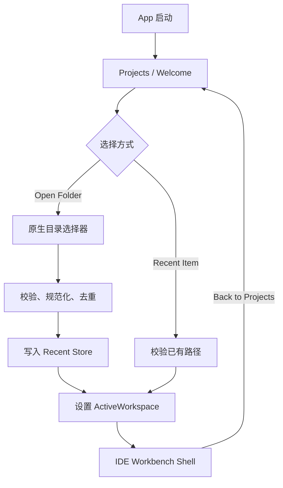
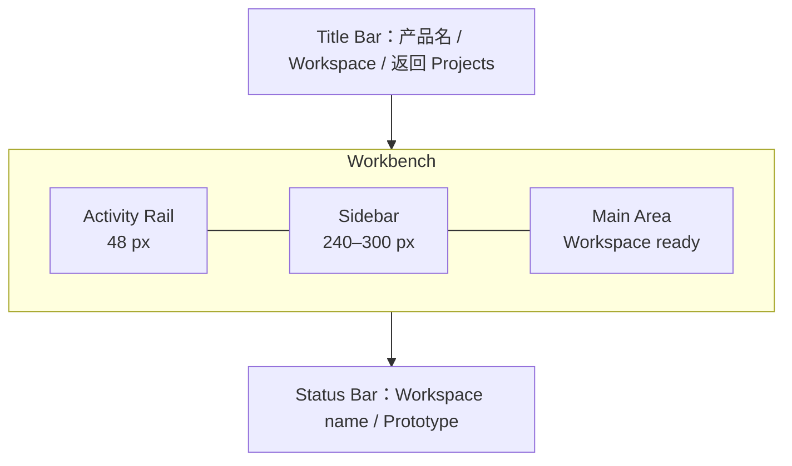
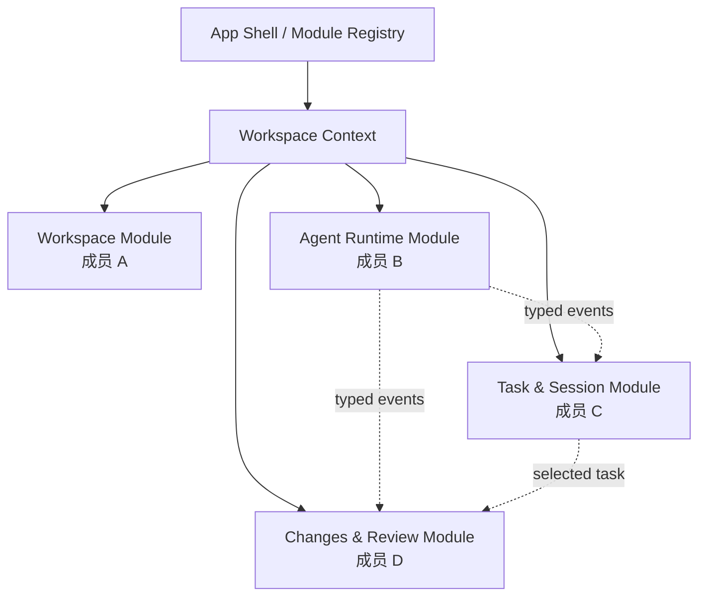

# AI Coding Workbench 原型：Workspace 模块 /goal、PRD 与四人敏捷开发框架

> 版本：v1.0  
> 日期：2026-07-24  
> 原型技术基线：Tauri 2 + React + TypeScript + Vite  
> 当前模块负责人：Workspace & App Shell

## 0. 先明确本轮边界

本轮不是开发完整 IDE，也不是接入 Claude Code、Codex CLI、Gemini CLI。

本轮只交付一个可独立验收的 **Workspace Shell**：

1. 应用启动后展示类似 PyCharm Welcome Screen 的本地项目管理页；
2. 用户可以选择一个真实本地目录加入最近项目；
3. 最近项目在应用重启后仍然存在；
4. 点击项目后进入一个简单、统一、可供其他模块挂载的 IDE 外壳；
5. IDE 外壳只呈现布局和当前项目上下文，不实现代码编辑、Agent 调度、终端、Git Diff 或对话功能。

P0 禁止项：

- 不接入 Monaco Editor；
- 不执行任何 AI CLI；
- 不读写项目源文件；
- 不创建、删除、重命名项目内文件；
- 不做终端；
- 不做 Git；
- 不做多窗口；
- 不做账号、云同步、插件市场；
- 不在用户项目目录写入隐藏配置文件。

这样定义的原因是：Workspace 是全产品的上下文入口，不应与后续 Agent、会话和 Diff 模块耦合。

---

# 第一部分：可直接投喂 Coding Agent 的 `/goal`

下面整段可以直接复制给 Codex CLI、Claude Code 或 Gemini CLI。首次执行时，把 `<项目仓库路径>` 替换为真实路径。

```text
/goal

你是一名资深 Tauri 桌面端工程师。请在现有仓库 <项目仓库路径> 中实现 AI Coding Workbench 原型的 Workspace & App Shell 模块。

在改代码前，先完成以下检查：
1. 阅读 README、package.json、src-tauri/Cargo.toml、src-tauri/tauri.conf.json 和现有 src 目录；
2. 执行 git status，确认并保护所有已有改动；
3. 识别仓库实际包管理器、前端框架、路由方式、代码风格和测试命令；
4. 如果仓库已经是 Tauri 2 + React + TypeScript，则在现有结构中增量实现，禁止重新脚手架；
5. 如果实际结构与下面建议不同，保留现有工程约定，但必须维持模块边界和数据契约；
6. 先给出简短实施计划和预计修改文件，再开始编码。

【产品背景】
开发者需要同时使用 Claude Code、Codex CLI、Gemini CLI 等 AI coding 工具并管理多个本地项目。目前用户要在 IDE、终端、文件管理器和不同 AI CLI 间反复切换。本产品希望成为面向 AI coding 的统一工作台。

【本次唯一目标】
实现一个类似 PyCharm Welcome Screen 的本地 Workspace 管理启动页，并在用户打开某个 Workspace 后进入一个简单 IDE 外壳。其他业务功能一律不实现，只为后续模块保留清晰挂载点。

【技术基线】
- Tauri 2
- React
- TypeScript，开启 strict
- Vite
- 优先沿用仓库已有样式方案；若没有，使用 CSS Modules 或普通 CSS + CSS variables
- 使用 @tauri-apps/plugin-dialog 选择本地文件夹
- 使用 @tauri-apps/plugin-store 持久化最近 Workspace
- 不新增大型状态管理库；本模块使用 React Context + reducer 或一个轻量 service
- 不引入 Monaco Editor
- 不申请全盘文件系统通配权限

【必须实现的 P0 用户流程】
1. 冷启动：
   - 展示 Welcome / Projects 页面；
   - 页面包含产品标识、Open Folder 主按钮、Recent Workspaces 区域；
   - 没有记录时展示空状态。

2. 添加本地 Workspace：
   - 点击 Open Folder，调用 Tauri 原生目录选择器；
   - 用户取消选择时不报错、不产生记录；
   - 选择目录后校验路径存在且为目录；
   - 以规范化绝对路径作为去重依据；
   - 新目录加入最近列表；已存在目录只更新 lastOpenedAt；
   - 自动进入 IDE Shell。

3. 最近 Workspace：
   - 按 lastOpenedAt 降序排列；
   - 每项至少显示 name、path、lastOpenedAt；
   - 单击选中，双击或点击 Open 进入；
   - 提供 Remove from Recent，只移除应用内记录，不删除磁盘目录；
   - 应用重启后列表仍然存在；
   - 若路径已失效，显示 Missing 状态；尝试打开时给出可理解错误，并允许从最近列表移除。

4. IDE Shell：
   - 顶部标题栏显示产品名和当前 Workspace 名；
   - 左侧预留 Activity Rail；
   - 左侧主侧栏显示 Explorer 标题、Workspace 名和根目录占位节点；
   - 中央区域显示静态欢迎占位：“Workspace ready”及当前路径；
   - 底部显示静态 Status Bar；
   - 提供返回 Projects 的入口；
   - 当前阶段所有 Agent、Chat、Terminal、Source Control、Diff 图标若展示，必须禁用并标注 Coming soon，禁止伪造可用功能。

【视觉要求】
- 整体为专业桌面开发工具风格，默认深色；
- Welcome 页面参考 PyCharm 的“左侧操作区 + 右侧最近项目”信息层级，但不要复制品牌资产；
- 窗口最小建议尺寸 960 × 640；
- CSS 颜色、间距、圆角、边框、字体必须使用共享 design tokens；
- 支持 1280×720 和 1440×900，不出现横向滚动；
- focus、hover、selected、disabled、missing 状态必须可区分；
- 键盘焦点可见；按钮必须有可访问名称。

【固定数据契约】
请在 src/core/contracts/workspace.ts 定义并只从该文件导出：

type WorkspaceId = string;

interface WorkspaceRecord {
  id: WorkspaceId;
  name: string;
  rootPath: string;
  normalizedPath: string;
  lastOpenedAt: string;   // ISO 8601
  createdAt: string;      // ISO 8601
  status: 'available' | 'missing';
}

interface ActiveWorkspace {
  id: WorkspaceId;
  name: string;
  rootPath: string;
}

interface WorkspaceService {
  list(): Promise<WorkspaceRecord[]>;
  chooseAndAdd(): Promise<WorkspaceRecord | null>;
  open(id: WorkspaceId): Promise<ActiveWorkspace>;
  removeRecent(id: WorkspaceId): Promise<void>;
  refreshAvailability(): Promise<void>;
}

约束：
- id 应稳定，可由 normalizedPath 的稳定哈希生成；
- Windows 路径去重要处理盘符大小写和分隔符差异；
- rootPath 只用于展示和调用后端，不允许拼入 HTML；
- 不在 localStorage 存储本地路径，使用 Tauri store；
- 当前 Workspace 状态通过 WorkspaceContext 暴露给 App Shell；
- 其他模块只能依赖 ActiveWorkspace，不得直接读取 Workspace 模块内部 store。

【建议目录边界】
src/
  app/
    App.tsx
    routes.tsx
    shell/
      WorkbenchShell.tsx
      ActivityRail.tsx
      SidebarSlot.tsx
      MainSlot.tsx
      StatusBar.tsx
  core/
    contracts/
      workspace.ts
      workbench.ts
    events/
      appEvents.ts
    registry/
      moduleRegistry.ts
  modules/
    workspace/
      components/
      pages/
        WelcomePage.tsx
        WorkspaceShellPage.tsx
      services/
        workspaceService.ts
      state/
        WorkspaceContext.tsx
      index.ts
  shared/
    components/
    styles/
      tokens.css
      global.css

src-tauri/src/
  modules/
    workspace.rs

不要跨模块创建重复的 Workspace 类型。

【为四人协作保留的 App Shell 插槽】
在 src/core/contracts/workbench.ts 定义：

type ModuleId = 'workspace' | 'agents' | 'sessions' | 'changes';

interface WorkbenchModule {
  id: ModuleId;
  title: string;
  order: number;
  icon: React.ComponentType;
  sidebar: React.LazyExoticComponent<React.ComponentType>;
  main: React.LazyExoticComponent<React.ComponentType>;
  isEnabled: (ctx: { workspace: ActiveWorkspace | null }) => boolean;
}

实现一个静态 moduleRegistry。当前只注册 workspace；为其他三个模块留下注册位置，不要实现他们的 UI，也不要从 Workspace 内部 import 他们。

【状态与错误】
- 首次加载 store 时显示 loading skeleton；
- store 数据损坏时回退为空列表并显示非阻断提示；
- 文件夹选择取消不是错误；
- 相同路径不能产生重复项目；
- Missing 项目不能进入 Shell；
- Remove from Recent 必须明确说明不会删除本地目录；
- 所有异步操作避免重复点击，可显示 pending 状态。

【测试与验收】
至少覆盖：
1. 空列表渲染；
2. 最近项目按时间倒序；
3. 相同 normalizedPath 去重；
4. removeRecent 不触碰真实目录；
5. 目录选择取消返回 null；
6. 打开有效 Workspace 后 Shell 显示正确 name 和 rootPath；
7. Missing Workspace 被阻止打开；
8. 应用重启或重新加载 service 后记录仍存在。

如 Tauri 原生能力在前端单元测试中不可用，请抽象 adapter 并 mock，不要在组件中直接散落 invoke/open/store 调用。

执行并报告仓库中实际可用的检查：
- format
- lint
- typecheck
- unit test
- tauri build 或至少 cargo check

【禁止事项】
- 不重写无关模块；
- 不修改其他成员负责的 modules/agents、modules/sessions、modules/changes；
- 不实现 AI Agent、聊天、终端、Git、Diff 或代码编辑；
- 不创建假的后端调用来伪装功能完成；
- 不使用 any 绕过类型；
- 不把本地绝对路径写死进源码；
- 不申请 "*" 文件系统权限；
- 不提交 node_modules、dist、target；
- 不删除或覆盖用户已有改动；
- 不自行 git commit，除非我明确要求。

【最终输出格式】
完成后请按以下顺序回答：
1. 已完成的用户流程；
2. 修改/新增文件；
3. 核心架构与数据流；
4. 已执行命令和结果；
5. 尚未完成或受环境限制的内容；
6. 手工验收步骤。
```

---

# 第二部分：Workspace 模块 PRD

## 1. 产品背景

AI coding 提升了单个编码任务的速度，却把完整开发流程拆散在多个工具、项目目录和上下文中。用户需要不断回答三个问题：

- 我现在在哪个项目？
- 哪个 Agent 正在处理什么任务？
- 它改了哪些代码，我下一步应该看哪里？

Workspace 模块先解决第一个问题，并成为后续 Agent、Session、Changes 模块的统一上下文入口。

## 2. 产品目标

### 2.1 本轮目标

- 让用户在 3 秒内找到并打开最近的本地项目；
- 让应用能够稳定记住多个本地项目；
- 进入项目后建立统一的 `ActiveWorkspace`；
- 提供稳定的 IDE Shell，让另外三名成员独立挂载模块；
- 演示时形成“项目选择 → 工作台”的完整产品闭环。

### 2.2 成功指标

| 指标 | 目标 |
|---|---:|
| 从启动到打开最近项目 | 不超过 2 次主动点击 |
| 添加重复路径产生的记录数 | 1 |
| 重启后最近项目保留率 | 100% |
| Missing 路径被误打开 | 0 |
| Workspace 模块对其他业务模块的直接 import | 0 |
| 1280×720 下关键操作可见 | 100% |

### 2.3 非目标

- 完整代码编辑器；
- 语法高亮、LSP、调试器；
- 真实终端；
- Git 状态和 Diff；
- Agent 安装、鉴权、执行与权限控制；
- 多根目录 Workspace；
- SSH / WSL / 容器 / 远程项目；
- 云端项目同步；
- 项目模板与 New Project Wizard。

## 3. 核心用户故事

### US-01：打开已有本地项目

作为同时维护多个项目的开发者，我希望从原生目录选择器添加一个项目，以便直接进入统一工作台。

### US-02：快速重新进入最近项目

作为每天在多个仓库间切换的开发者，我希望启动时看到最近项目并按最近使用排序，以便减少目录查找。

### US-03：识别失效目录

作为移动或删除过项目的开发者，我希望应用明确标记失效路径，而不是打开后无响应。

### US-04：获得稳定工作台上下文

作为后续功能模块的开发者，我希望只依赖统一的 `ActiveWorkspace`，以便 Agent、会话和 Diff 模块不关心启动页和持久化细节。

## 4. 信息架构



## 5. 页面规格

### 5.1 Projects / Welcome 页面

建议布局：

- 左侧 240 px：
  - 产品 Logo / 名称；
  - `Open Folder` 主按钮；
  - 当前版本号或 Prototype 标签；
- 右侧：
  - 标题 `Recent Workspaces`；
  - 项目列表；
  - 空状态、加载状态、错误提示；
- 项目项：
  - 项目名；
  - 完整路径或中间省略路径；
  - 最近打开时间；
  - available / missing 状态；
  - Open、Remove from Recent。

不展示 `New Project`、`Get from VCS`、`Customize`、`Plugins`，因为它们不属于当前原型范围。

### 5.2 IDE Shell



Shell 当前只有展示意义，但布局必须是真正可扩展的：

- Activity Rail 不直接承载业务逻辑；
- Sidebar 和 Main Area 根据 `moduleRegistry` 的当前模块渲染；
- Workspace 模块只负责默认 Explorer 占位；
- 后续成员不能直接修改 Shell DOM 结构。

## 6. 功能需求与 GitHub 参考

> 参考页面用于理解交互、工程组织或官方 API，不表示复制其完整实现或视觉资产。

| ID | 优先级 | 需求 | 验收标准 | 参考 GitHub 页面 |
|---|---|---|---|---|
| WS-01 | P0 | Projects 启动页 | 冷启动进入 Projects；有产品标识、Open Folder、Recent Workspaces；无记录时有空状态 | [IntelliJ Recent Projects / Manage Projects 文案与行为](https://github.com/JetBrains/intellij-community/blob/master/platform/platform-resources-en/src/messages/ActionsBundle.properties) |
| WS-02 | P0 | 原生目录选择 | 点击 Open Folder 打开桌面原生目录选择器；取消后不产生错误和记录 | [Tauri v2 Dialog Plugin](https://github.com/tauri-apps/plugins-workspace/tree/v2/plugins/dialog) |
| WS-03 | P0 | 路径校验与规范化 | 只接受存在的目录；Windows 处理盘符大小写与分隔符；无效路径返回结构化错误 | [Tauri v2 FS Plugin](https://github.com/tauri-apps/plugins-workspace/tree/v2/plugins/fs) |
| WS-04 | P0 | 最近项目持久化 | 增删和更新时间可持久保存；应用重启后恢复；损坏数据安全回退 | [Tauri v2 Store Plugin](https://github.com/tauri-apps/plugins-workspace/tree/v2/plugins/store) |
| WS-05 | P0 | 去重和最近排序 | 同一 normalizedPath 只保留一条；每次打开更新 lastOpenedAt；列表倒序 | [IntelliJ LRU / Open Recent 定义](https://github.com/JetBrains/intellij-community/blob/master/platform/platform-resources-en/src/messages/ActionsBundle.properties) |
| WS-06 | P0 | 从最近列表移除 | Remove from Recent 只移除元数据；二次文案明确“不删除本地文件” | [IntelliJ Manage Recent Projects](https://github.com/JetBrains/intellij-community/blob/master/platform/platform-resources-en/src/messages/ActionsBundle.properties) |
| WS-07 | P0 | Missing 状态 | 启动或打开前检查目录；失效项标记 Missing；不能进入 Shell；可移除 | [VS Code Explorer 的文件树刷新与错误处理入口](https://github.com/microsoft/vscode/blob/main/src/vs/workbench/contrib/files/browser/views/explorerView.ts) |
| WS-08 | P0 | IDE App Shell | 包含 Title Bar、Activity Rail、Sidebar、Main、Status Bar；布局在 1280×720 可用 | [VS Code Activity Bar 实现](https://github.com/microsoft/vscode/blob/main/src/vs/workbench/browser/parts/activitybar/activitybarPart.ts) |
| WS-09 | P0 | Workspace 上下文 | 打开后全局可读取 `ActiveWorkspace`；刷新或返回 Projects 时状态明确；其他模块不读内部 store | [Eclipse Theia Workspace 模块](https://github.com/eclipse-theia/theia/tree/master/packages/workspace) |
| WS-10 | P0 | 模块注册表 | Shell 通过 `moduleRegistry` 渲染业务区域；当前只启用 workspace；其余模块按契约接入 | [Eclipse Theia 模块化仓库结构](https://github.com/eclipse-theia/theia) |
| WS-11 | P0 | 加载、空、错误、禁用状态 | store 加载有 skeleton；重复操作禁用；错误可理解且不造成白屏 | [VS Code Workbench 基础 UI 组件目录](https://github.com/microsoft/vscode/tree/main/src/vs/base/browser/ui) |
| WS-12 | P0 | 统一视觉 tokens | 颜色、间距、边框、圆角、字体均来自 tokens；focus 可见；禁用状态可区分 | [VS Code 主题资源](https://github.com/microsoft/vscode/tree/main/extensions/theme-defaults/themes) |
| WS-13 | P1 | 只读浅层文件树 | 若 P0 全部完成，可读取根目录并展示至多 2 层；忽略 node_modules/.git/target/dist；不可编辑 | [VS Code Explorer View](https://github.com/microsoft/vscode/blob/main/src/vs/workbench/contrib/files/browser/views/explorerView.ts) |
| WS-14 | Future | 真实编辑区 | 当前只保留 Main Slot，后续若做代码编辑再评估 Monaco；本轮不得引入 | [Monaco Editor](https://github.com/microsoft/monaco-editor) |

## 7. 数据设计

```ts
export type WorkspaceId = string;

export interface WorkspaceRecord {
  id: WorkspaceId;
  name: string;
  rootPath: string;
  normalizedPath: string;
  lastOpenedAt: string;
  createdAt: string;
  status: 'available' | 'missing';
}

export interface WorkspaceStoreSchema {
  schemaVersion: 1;
  workspaces: WorkspaceRecord[];
}

export interface ActiveWorkspace {
  id: WorkspaceId;
  name: string;
  rootPath: string;
}
```

规则：

- `normalizedPath` 是唯一键；
- `id` 从 normalizedPath 稳定生成，不使用数组下标；
- store 文件建议命名 `workspaces.v1.json`；
- schemaVersion 为以后迁移保留；
- 时间统一写 ISO 8601，展示时本地化；
- 不保存 Agent 状态、Git 状态、打开文件列表；
- 不把元数据写入用户项目。

## 8. 服务边界

### 8.1 前端服务

```ts
export interface WorkspaceService {
  list(): Promise<WorkspaceRecord[]>;
  chooseAndAdd(): Promise<WorkspaceRecord | null>;
  open(id: WorkspaceId): Promise<ActiveWorkspace>;
  removeRecent(id: WorkspaceId): Promise<void>;
  refreshAvailability(): Promise<void>;
}
```

组件只调用 `WorkspaceService`，不直接同时操作 dialog、store 和 Rust command。

### 8.2 后端命令建议

```rust
#[tauri::command]
fn workspace_inspect_path(path: String) -> Result<WorkspacePathInfo, WorkspaceError>;

#[tauri::command]
fn workspace_check_exists(path: String) -> Result<bool, WorkspaceError>;
```

命令名必须带 `workspace_` 前缀，防止与其他成员命令冲突。

### 8.3 错误模型

```ts
type WorkspaceErrorCode =
  | 'PATH_NOT_FOUND'
  | 'NOT_A_DIRECTORY'
  | 'PERMISSION_DENIED'
  | 'STORE_CORRUPTED'
  | 'UNKNOWN';

interface WorkspaceError {
  code: WorkspaceErrorCode;
  message: string;
  recoverable: boolean;
}
```

UI 不直接展示 Rust/JS 原始堆栈。

## 9. 交互细节

| 场景 | 产品行为 |
|---|---|
| 用户取消目录选择 | 原地停留，无 toast |
| 用户重复选择同一路径 | 更新原记录的 lastOpenedAt 并打开 |
| 路径末尾含 `/` 或 `\` | 规范化后去重 |
| Windows 盘符大小写不同 | 视为同一路径 |
| 项目被移动或删除 | 标记 Missing，禁止进入 |
| store 加载失败 | 显示非阻断警告，以空列表启动 |
| 快速连点 Open | 第一次 pending 时禁用按钮 |
| 点击 Remove | 明确只移除最近记录，不删除目录 |
| 返回 Projects | 清空或挂起 active workspace，行为须稳定且有测试 |

## 10. 验收用例

### AC-01：首次启动

前置：无 store。  
操作：启动应用。  
期望：显示空 Recent Workspaces 和 Open Folder；无报错。

### AC-02：加入并打开目录

前置：有一个可读目录。  
操作：Open Folder → 选目录。  
期望：生成一条记录并进入 Shell；标题、中央区显示正确项目名和路径。

### AC-03：重复路径

操作：连续两次选择同一目录。  
期望：列表始终一条，lastOpenedAt 更新。

### AC-04：重启恢复

操作：加入两个目录 → 关闭应用 → 重启。  
期望：两条记录仍存在，按最近打开时间倒序。

### AC-05：失效路径

操作：在外部移动已记录目录 → 重启 → 点击记录。  
期望：记录显示 Missing，不能进入 Shell，可以移除。

### AC-06：安全移除

操作：Remove from Recent。  
期望：记录消失，磁盘目录和内部文件保持不变。

### AC-07：取消选择

操作：点击 Open Folder 后取消。  
期望：页面无变化，不显示错误。

### AC-08：布局

操作：在 1280×720 与 1440×900 查看两个页面。  
期望：关键操作可见，无横向滚动，长路径可省略并通过 title 查看。

## 11. Definition of Done

- 所有 P0 验收用例通过；
- typecheck、lint、unit test 通过；
- `cargo check` 通过；
- 能以 Tauri 开发模式启动；
- 没有 `any`、硬编码本地路径、全盘 FS 权限；
- 没有修改其他三人的业务模块；
- 新增依赖已在 PR 说明用途；
- README 有启动和手工验收步骤；
- 截图至少包括空启动页、有项目启动页、IDE Shell、Missing 状态；
- 合并后其他成员只需注册 module manifest，不需要改 Workspace 内部代码。

---

# 第三部分：支撑四人的模块化敏捷开发框架

## 1. 总体架构



核心原则：

1. **Workspace Context 是唯一项目上下文源**；
2. **模块不互相 import 内部文件**；
3. **跨模块只使用 `src/core/contracts` 和 typed events**；
4. **App Shell 只负责布局和模块挂载，不包含业务逻辑**；
5. **三天原型使用静态模块注册表，不开发复杂插件系统**；
6. **真实能力与演示 Mock 使用相同接口，UI 不感知来源**。

## 2. 四人分工

| 成员 | 模块所有权 | 必须交付 | 不得修改 |
|---|---|---|---|
| A（你） | `workspace` + `app/shell` + Workspace contracts | Projects 启动页、目录选择、recent store、ActiveWorkspace、IDE Shell、moduleRegistry | Agent 进程、会话业务、Git Diff |
| B | `agents` + Rust process adapter | Agent 列表、统一 AgentAdapter、启动/停止状态、输出流；环境不具备时提供可切换 mock adapter | Workspace store、会话页面、Diff 页面 |
| C | `sessions` | Task/Session 列表、对话历史 UI、输入区、按 Workspace 隔离的 demo 数据、消费 Agent events | Rust 进程实现、Workspace 内部、Git |
| D | `changes` + QA 辅助 | 变更文件列表、Diff 展示或可靠 mock、接受/拒绝的原型交互、跨模块 smoke tests | Workspace store、Agent adapter 内部、会话内部 |

### 模块入口统一格式

每个模块只通过自己的 `index.ts` 暴露：

```ts
export { manifest } from './manifest';
export type { PublicModuleType } from './types';
```

其他模块禁止使用：

```ts
import { something } from '@/modules/agents/internal/...';
```

## 3. 推荐仓库结构

```text
src/
  app/
    App.tsx
    routes.tsx
    shell/
  core/
    contracts/
      workspace.ts
      workbench.ts
      agents.ts
      sessions.ts
      changes.ts
      events.ts
    events/
      appEventBus.ts
    registry/
      moduleRegistry.ts
  modules/
    workspace/       # A
    agents/          # B
    sessions/        # C
    changes/         # D
  shared/
    components/
    icons/
    styles/
      tokens.css
      global.css
    test/

src-tauri/src/
  modules/
    mod.rs
    workspace.rs     # A
    agents.rs        # B
    changes.rs       # D
```

## 4. 共享契约冻结版

### 4.1 WorkbenchModule

```ts
export type ModuleId = 'workspace' | 'agents' | 'sessions' | 'changes';

export interface WorkbenchContext {
  workspace: ActiveWorkspace;
}

export interface WorkbenchModule {
  id: ModuleId;
  title: string;
  order: number;
  icon: React.ComponentType<{ size?: number }>;
  sidebar: React.LazyExoticComponent<React.ComponentType>;
  main: React.LazyExoticComponent<React.ComponentType>;
  isEnabled(ctx: WorkbenchContext): boolean;
}
```

### 4.2 AgentAdapter

```ts
export type AgentKind = 'claude-code' | 'codex-cli' | 'gemini-cli';
export type AgentRunStatus =
  | 'idle'
  | 'starting'
  | 'running'
  | 'waiting-user'
  | 'completed'
  | 'failed'
  | 'cancelled';

export interface AgentRunRequest {
  workspace: ActiveWorkspace;
  agent: AgentKind;
  prompt: string;
  taskId: string;
}

export interface AgentOutputEvent {
  runId: string;
  taskId: string;
  kind: 'stdout' | 'stderr' | 'status';
  content: string;
  timestamp: string;
}

export interface AgentAdapter {
  isAvailable(): Promise<boolean>;
  start(req: AgentRunRequest): Promise<{ runId: string }>;
  cancel(runId: string): Promise<void>;
  subscribe(listener: (event: AgentOutputEvent) => void): () => void;
}
```

### 4.3 Session 与 Changes 最小契约

```ts
export interface TaskSession {
  id: string;
  workspaceId: WorkspaceId;
  title: string;
  agent: AgentKind;
  status: AgentRunStatus;
  createdAt: string;
  updatedAt: string;
}

export interface ChangedFile {
  workspaceId: WorkspaceId;
  taskId?: string;
  relativePath: string;
  status: 'added' | 'modified' | 'deleted' | 'renamed';
  additions?: number;
  deletions?: number;
}
```

规则：

- 跨模块一律传 `workspaceId` 和相对路径；
- 只有 Workspace/Rust 边界持有 rootPath；
- Changes 模块拼接磁盘路径时必须通过后端安全校验；
- UI 中的 Agent 输出不能当作 shell 命令再次执行；
- Mock 和真实实现必须满足同一接口。

## 5. Typed Event Bus

```ts
export interface AppEventMap {
  'workspace:opened': ActiveWorkspace;
  'workspace:closed': { workspaceId: WorkspaceId };
  'agent:run-started': { runId: string; taskId: string };
  'agent:output': AgentOutputEvent;
  'agent:run-finished': {
    runId: string;
    taskId: string;
    status: Extract<AgentRunStatus, 'completed' | 'failed' | 'cancelled'>;
  };
  'session:selected': { sessionId: string; taskId: string };
  'changes:updated': { workspaceId: WorkspaceId; taskId?: string };
}
```

事件要求：

- 事件名使用 `domain:past-tense`；
- payload 必须有明确类型；
- 禁止通过事件传 React component、DOM node、大段文件内容；
- 事件只通知状态变化，事实数据仍从对应 service 查询；
- 所有订阅必须返回 unsubscribe 并在组件卸载时释放。

## 6. Git 与代码所有权

### 分支

- `main`：始终可运行；
- `feat/workspace-shell`：A；
- `feat/agent-runtime`：B；
- `feat/task-sessions`：C；
- `feat/changes-review`：D；
- `chore/integration-*`：短期集成修复。

### 代码所有权

```text
/src/modules/workspace/   A
/src/app/shell/           A
/src/modules/agents/      B
/src-tauri/src/modules/agents.rs B
/src/modules/sessions/    C
/src/modules/changes/     D
/src-tauri/src/modules/changes.rs D
/src/core/contracts/      四人共同评审
/src/shared/              至少一人评审
```

### 合并纪律

- 每人只在自己的目录主开发；
- 修改 `core/contracts` 前先在群里贴出差异，获得至少一人确认；
- 不允许为了“方便”直接 import 别人模块内部 store；
- PR 尽量保持单一目的；
- 合并前 rebase 或 merge 最新 main，并运行统一检查；
- 每天至少两次集成到 main，避免第三天集中爆炸；
- 禁止四个人同时编辑 `App.tsx`：模块接入只改 `moduleRegistry.ts`。

## 7. 三天 Sprint 计划

### Day 0 / 开工前 1 小时

全员共同完成：

- 确认技术栈与包管理器；
- 创建上述目录；
- 冻结 `workspace.ts`、`workbench.ts`、`events.ts`；
- 确认 tokens、按钮、空状态基础组件；
- 每个模块提交一个能被 registry 加载的占位 manifest；
- main 能启动。

### Day 1 / 形成纵向切片

| 成员 | 当日结果 |
|---|---|
| A | Projects 页面、Open Folder adapter、recent 数据模型、IDE Shell |
| B | AgentAdapter、三种 Agent 元数据、mock run 流程、状态机 |
| C | Task/Session 左栏、对话主区、消费 mock output |
| D | ChangedFile 模型、变更列表、Diff 演示数据、基础 smoke test |

当天 17:00 集成目标：

`选择 Workspace → 进入 Shell → 切换四个模块` 全链路可操作，即使后三个模块暂时是 mock。

### Day 2 / 补真实能力与异常

| 成员 | 当日结果 |
|---|---|
| A | store 持久化、去重、Missing、测试、响应式 |
| B | 探测本机 CLI、真实/Mock adapter 切换、取消与错误状态 |
| C | session 状态更新、历史切换、输入交互、Workspace 隔离 |
| D | Git diff 或安全 mock、文件状态、Diff 视图、集成测试 |

当天 17:00 集成目标：

演示路径稳定；任何缺少本地 CLI 或 Git 的环境都能自动回退到明确标注的 Demo Mode，而不是报错。

### Day 3 / 冻结与路演

上午：

- 只修 P0；
- 禁止新增依赖和改核心契约；
- 完成 lint、typecheck、test、cargo check；
- 在干净环境执行一次安装与启动。

下午：

- 录制 2–3 分钟备份演示；
- 准备 3 个示例 Workspace；
- 准备“CLI 已安装”和“CLI 未安装”两套演示路径；
- 冻结 main，之后只允许阻断性 bug 修复。

## 8. 每日 15 分钟站会模板

每人只回答：

1. 昨天完成了哪一个可操作用户流程？
2. 今天结束时能演示什么？
3. 是否需要修改共享 contract？
4. 当前 blocker 是代码、环境还是产品决策？
5. 需要谁在什么时间前提供什么？

禁止只说“正在开发页面”“完成 70%”。

## 9. 集成检查矩阵

| 检查 | A | B | C | D |
|---|---:|---:|---:|---:|
| 能获得 ActiveWorkspace | 负责 | 消费 | 消费 | 消费 |
| 无 Workspace 时模块禁用 | 负责 | 验证 | 验证 | 验证 |
| module manifest 可加载 | 负责 registry | 提供 | 提供 | 提供 |
| typed events 无 any | 评审 | 负责 Agent 事件 | 负责 Session 事件 | 负责 Changes 事件 |
| 真实目录不被误删 | 负责 recent | 验证 cwd | 不操作 | 验证 Git 只读 |
| Demo Mode 明确标注 | 不适用 | 负责 | 消费 | 负责 |
| 端到端 smoke test | 协助 | 协助 | 协助 | 负责 |

## 10. 四人统一 Coding Agent 约束提示词

每位成员在自己的 `/goal` 最后附上：

```text
【团队协作约束】
这是一个四人并行开发的 Tauri 原型。

1. 只修改你负责的模块目录；修改 src/core/contracts、src/shared 或 App Shell 前必须先说明原因；
2. 禁止从其他 modules/* 的内部路径 import，只能使用对方 index.ts 和 src/core/contracts；
3. 禁止重新定义 WorkspaceRecord、ActiveWorkspace、AgentRunStatus、TaskSession、ChangedFile；
4. 所有 Tauri command 使用模块前缀：workspace_*、agent_*、session_*、review_*；
5. 所有跨模块事件必须在 AppEventMap 中声明，禁止 string + any；
6. 使用 src/shared/styles/tokens.css，禁止在业务组件散落新的主题色；
7. 不替换既有路由、构建工具、包管理器和 lint 配置；
8. 不删除、覆盖或格式化无关文件；
9. 新依赖必须说明用途，并优先复用现有依赖；
10. 真实能力暂不可用时，实现同接口 Mock 并明确标注 Demo Mode，禁止伪装成功；
11. 每次修改后至少运行与本模块相关的 typecheck、test；合并前运行团队统一检查；
12. 最终报告必须列出修改文件、共享契约变化、命令结果、已知限制和手工验收路径。
```

## 11. 原型路演主路径

建议统一演示：

1. 打开应用，展示最近三个 Workspace；
2. 添加一个真实本地目录；
3. 进入 IDE Shell，解释 Workspace 已成为所有 Agent 的统一 cwd；
4. 切到 Agents，选择 Codex / Claude / Gemini；
5. 创建一个任务，在 Session 中查看过程；
6. 切到 Changes 查看文件改动；
7. 回到 Projects，切换另一个 Workspace；
8. 总结产品价值：从“工具切换”变成“以 Workspace 和任务为中心的统一控制平面”。

其中第 1–3、7 步由 Workspace 模块保证；其他模块即使使用 Demo Mode，也必须遵循真实数据契约。

---

# 第四部分：最终决策摘要

- 当前你应该先做的是 **Workspace Context + Projects Welcome + App Shell**，不是 IDE 编辑器；
- Welcome 页模仿 PyCharm 的信息架构，不复制品牌；
- 使用 Tauri Dialog 选择目录，Store 保存 recent metadata；
- 真实项目目录保持只读，不写 `.workbench` 等隐藏文件；
- 其他三人的功能通过 `moduleRegistry + ActiveWorkspace + typed events` 接入；
- 三天内采用静态注册表和接口化 Mock，避免开发动态插件系统；
- 所有共享类型在 Day 0 冻结，Day 3 禁止改 contract；
- Workspace 是整个原型能否并行开发和顺利集成的关键基础模块。
